  

  
  

---

## 🚀 About Me

- 🔭 Building **[Hive](https://github.com/fahad10inb/hive)** — an outcome-driven AI agent framework with multi-agent execution and HITL controls
- ⚡ Shipping **[Cricket Butterfly Effect](https://github.com/fahad10inb/cricket-bf)** — an AI alternate-universe cricket simulator with Express APIs and browser UX
- 🧭 Advancing **[SyncTrek](https://github.com/fahad10inb/SyncTrek)** — an AI-powered, mobile-first travel planner currently in Android beta
- 🌱 Focused on applied **AI/ML product building** — from agent systems to recommendation and evaluation workflows
- 📫 Reach me at **fahadrahiman10@gmail.com**

---

## 🛠️ Tech Stack

**Languages & Frameworks** 

**AI / ML & Data** 

**Databases & Cloud** 

**Tools** 

---

## 📌 Featured Projects

| Project | What it does | Stack |
|---|---|---|
| 🐝 **[Hive](https://github.com/fahad10inb/hive)** | Outcome-driven AI agent framework with goal loops, observability, and human-in-the-loop controls | Python · TypeScript · Docker |
| 🏏 **[Cricket Butterfly Effect](https://github.com/fahad10inb/cricket-bf)** | AI-powered alternate-universe cricket history simulator with story generation and scenario branching | Express · JavaScript · Supabase · Vercel |
| 🧳 **[SyncTrek](https://github.com/fahad10inb/SyncTrek)** | AI-powered travel planner that generates personalized itineraries for a mobile-first experience | Flutter · Dart · AI Agents |
| 🤖 **[hiring-agent](https://github.com/fahad10inb/hiring-agent)** | AI resume evaluation workflow for screening and ranking candidates | Python · NLP · Automation |

---

## 📊 GitHub Stats

  

  

---

## 🤝 Connect

  
  
  
  

⭐ Star a repo if it helps you build something.

